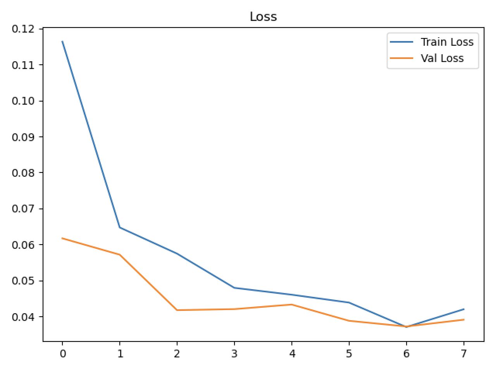
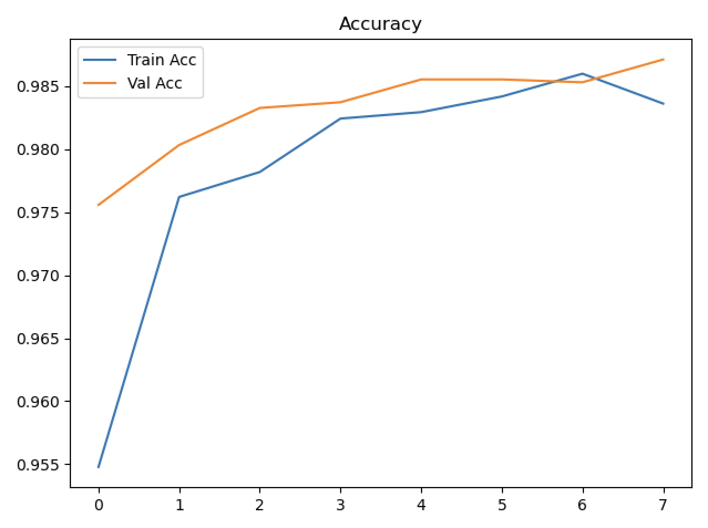
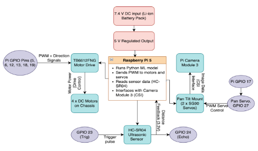

# Plant Health Monitoring Robot
## Autonomous Leaf Detection • Disease Classification • Obstacle Avoidance • Web Dashboard Control
## Introduction

This robot uses a Raspberry Pi, camera, TB6612 motor driver, ultrasonic sensor, and a machine-learning leaf classifier to autonomously navigate, detect plants, capture images, and classify plant health.

This README includes:

- Results
- Background and Methodology
- Block Diagram
- Full wiring guide
- Hardware pinout tables  
- System testing guide  
- Dashboard and autonomous mode instructions  
- Model training pipeline  
- Data preprocessing steps  
- Gate-based classification logic  
- TensorFlow Lite inference pipeline  
- Autonomous navigation overview
- Assumptions
- Current Limitations
---
# Results
## Model Performance Summary
The training process produced a strong and stable classifier with high accuracy and low overfitting:
| Metric | Value |
|--------|-------|
| Training Accuracy | 98.36% |
| Validation Accuracy | 98.71% |
| Training Loss | 0.042 |
| Validation Loss | 0.039 |
| Inference Speed (Raspberry Pi) | ~45 ms/frame (TFLite) |
| Model Size | 2.2 MB (TFLite) |


This close alignment between training and validation curves indicates:
- The model is not overfitting
- It generalizes well beyond the training images
- MobileNetV2 transfer learning is effective even with a relatively small dataset

### Interpretation of the Loss Curve
The loss curve shows:
- Smooth decrease in training loss
- Validation loss remains very close to training loss
- No divergence or spikes
This means the model is confident but not overly confident, and learns features that transfer well to real Pi camera images.

### Interpretation of the Accuracy Curve
Accuracy rises rapidly in early epochs and stabilizes near 97–99%, demonstrating:
- The ImageNet-pretrained features were highly effective
- The custom dense layers adapted well to leaf-health classification
- Augmentation prevented the model from memorizing the dataset

These results validate the ML pipeline and justify deploying the classifier on the Raspberry Pi.

### Plots
<p align="center">
  
  
</p>


---
# Background and Methodology
> Further explination and testing instructions are in sections *Dashboard and autonomous mode instructions, Model training pipeline, Data preprocessing steps, Gate-based classification logic, TensorFlow Lite inference pipeline*


Plant disease detection is critical for agriculture because early identification prevents crop loss and reduces pesticide usage. Traditional inspection is manual, slow, and inconsistent. This project explores an embedded AI approach where autonomous robots can monitor plant health continuously and cheaply.

## Project Overview
The goal of this project is to build an autonomous plant-health monitoring robot capable of:
- Navigating around plants
- Detecting leaves using onboard vision
- Classifying them as healthy or diseased
- Logging results and images
- Reporting everything to a web dashboard
- This combines embedded systems, machine learning, robotics, and real-time control into one system.

## Dataset and Classification Strategy
The model uses the PlantVillage dataset, which provides:
- Thousands of clean, high-resolution images
- Healthy and diseased leaves
- Tomato, potato, and pepper classes

Because PlantVillage contains only leaf images, the robot uses a two-gate confidence system:
1. Gate 1 — Leaf Detection:
    - If max softmax probability < 0.80 → NOT_LEAF
2. Gate 2 — Health Classification:
    - If confidence < 0.60 → UNSURE
    - Else → HEALTHY or DISEASED
   
This allows the robot to reject backgrounds, motion blur, and uncertain predictions.

## Model Architecture & Transfer Learning
A lightweight convolutional neural network was built using:
- MobileNetV2 pretrained on ImageNet
- Frozen base layers
    - A new classification head:
    - Global Average Pooling
    - Dense(128) + ReLU
    - Dropout
    - Dense(2) softmax

MobileNetV2 is chosen because:
- It is extremely efficient
- Runs in real time on the Raspberry Pi
- Already knows useful visual patterns
- Reduces training time while boosting accuracy

## Preprocessing Pipeline
To prepare images:
- Resize to 224×224
- Normalize pixel values to [0,1]
- Apply augmentation

This improves generalization when the robot encounters real plants under varying conditions.

## TensorFlow Lite Deployment
The trained model is converted to TFLite, enabling:
- Fast inference on the Raspberry Pi
- Low CPU usage
- Small file size
- Reliable real-time classification

The Pi runs a simplified inference pipeline:
1. Capture frame
2. Preprocess
3. Run TFLite model
4. Apply Gate 1 + 2
5. Save & log results
6. Display on dashboard

## Embedded Systems Concepts Used
This project applies several core embedded systems principles:
- GPIO control for motors and ultrasonic sensing
- PWM for speed control
- Interrupt-free real-time loops
- Threading to allow autonomous control + dashboard server simultaneously
- Low-power edge ML inference (TFLite)
- Shared power grounding for system stability
- Modular drivers supporting multiple motor controllers (L298N and TB6612)

## System Integration
All subsystems - motors, sensors, classifier, dashboard, and navigation logic - communicate through:
- Python modules
- Shared state variables
- Real time control loops
- Logging and file management

This forms a fully autonomous embedded AI system capable of perception, decision-making, and physical action.

---
# Block Diagram 
<p align="center">
  
</p>


---
# Universal Motor Driver System

This project now supports **two motor driver types**:

| Driver | File Used | Notes |
|--------|-----------|-------|
| **L298N** | `motor/l298n.py` | Works with older red dual-H-bridge modules |
| **TB6612** | `motor/tb6612.py` | Newer Adafruit-style high-efficiency motor driver |

You select the driver in:

### `config.py`
```python
MOTOR_DRIVER = "TB6612"   # or change to "L298N"
```

Then everywhere in the code, motors are used like:

```python
from motor import forward, backward, turn_left, turn_right, stop
```

The rest is automatic — the correct driver is imported internally.

---

# Pinout & Wiring Guide

This section describes how to wire the motors, TB6612 motor driver, battery pack, Raspberry Pi, and US-100 ultrasonic sensor.

## Motor Wiring
Below are wiring tables for **both motor drivers** so either one can be used.

### TB6612 Motor Driver Wiring

| Motor | Red Wire | Black Wire |
|--------|----------|-------------|
| Motor A (Left) | A01 | A02 |
| Motor B (Left) | A01 | A02 |
| Motor C (Right) | B01 | B02 |
| Motor D (Right) | B01 | B02 |

### L298N Motor Driver Wiring 

| Motor | Red Wire | Black Wire |
|--------|----------|-------------|
| Motor A/B (Left) | OUT1 | OUT2 |
| Motor C/D (Right) | OUT3 | OUT4 |

# Power System

### Battery Pack (4×AA or 6V motor pack)
- Battery **+** → motor driver **VM** (TB6612) or **12V IN** (L298N)  
- Battery **–** → motor driver **GND**

**Pi and motor driver MUST share ground.**  
**Do NOT power the Pi from the motor driver.**


## Raspberry Pi Power to Breadboard

| Pi Pin | Connects To |
|--------|-------------|
| 5V | Breadboard **5V rail** |
| GND | Breadboard **GND rail** |


## US-100 Ultrasonic Sensor Wiring

| US-100 Pin | Connects To |
|------------|-------------|
| VCC | Breadboard **5V rail** |
| GND | Breadboard **GND rail** |
| TRIG | Raspberry Pi GPIO **5** |
| ECHO | Raspberry Pi GPIO **6** |


## Raspberry Pi GPIO Summary

Both drivers use the **same direction and PWM pins**, but TB6612 requires one additional pin (**STBY**).

| Purpose | GPIO Pin | Used By |
|---------|----------|---------|
| Motor Left Direction 1 | **17** | L298N + TB6612 |
| Motor Left Direction 2 | **27** | L298N + TB6612 |
| Motor Right Direction 1 | **22** | L298N + TB6612 |
| Motor Right Direction 2 | **23** | L298N + TB6612 |
| Left Motor PWM | **12** | ENA (L298N) / PWMA (TB6612) |
| Right Motor PWM | **13** | ENB (L298N) / PWMB (TB6612) |
| **Motor Driver Standby (STBY)** | **24** | **TB6612 only** |
| Ultrasonic TRIG | **5** | L298N + TB6612 |
| Ultrasonic ECHO | **6** | L298N + TB6612 |

Notes
- **TB6612 requires STBY** (GPIO 24). This pin *must* be pulled HIGH for motors to operate.  
- **L298N does NOT use STBY.** If you're using L298N, ignore GPIO 24 entirely.  
- PWM pins (**12** and **13**) must support hardware PWM — these GPIOs do.

---

# System Testing Guide

Use these tests before running the full robot system.


## Camera Test

```bash
python3 - << 'EOF'
from picamera2 import Picamera2
import time

cam = Picamera2()
cam.configure(cam.create_preview_configuration())
cam.start()
time.sleep(1)
frame = cam.capture_array()
cam.stop()
print("Camera OK. Frame shape:", frame.shape)
EOF
```

**Expected:**
```
Camera OK. Frame shape: (480, 640, 3)
```


## Motor Test (works for TB6612 or L298N)
Because of the universal driver system, this test works for *everyone*:

```bash
cd plant_robot
python3 - << 'EOF'
from motor import forward, stop
import time

print("Motors test: forward for 1 sec")
forward(60)   # speed 0–100
time.sleep(1)
stop()
EOF
```

**Expected behavior:**
- Left & right motors spin forward for ~1 second.

If the motors do NOT move:
- Check motor driver wiring  
- Ensure battery pack is connected  
- Ensure grounds are shared  
- Ensure `config.py` has the correct driver selected  


## Ultrasonic Sensor Test

```bash
python3 - << 'EOF'
from ultrasonic import get_distance
import time

for i in range(5):
    print("Distance:", get_distance(), "cm")
    time.sleep(1)
EOF
```

Expected output:
```
Distance: 34.2 cm
Distance: 36.1 cm
Distance: 35.5 cm
```
---

# Dashboard Web Interface
### 1. Start the dashboard on the Pi
```bash
cd plant_robot
python3 dashboard.py
```

You should see:
```
Running on http://0.0.0.0:5000
```

### 2. Find the Pi’s IP
```bash
hostname -I
```

### 3. Open the dashboard on your computer
```
http://<PI-IP>:5000
```

You should see:
- RUNNING/STOPPED status  
- Start / Stop buttons  
- Classification logs  
- Thumbnail images

---

# Autonomous Robot Mode

Start autonomous control:

```bash
cd plant_robot
python3 autonomous_robot.py
```

Then in the dashboard, click:

### **START ROBOT**

The robot will:

1. Drive forward  
2. Avoid obstacles  
3. Capture leaf images  
4. Run the ML classifier  
5. Save snapshots & results  
6. Update dashboard  

---

# Machine Learning Model Pipeline

This section documents how the leaf classifier was trained.

## Dataset

We used **PlantVillage**, containing:

- Tomato leaves  
- Potato leaves  
- Pepper leaves  

From these, only two final classes were used:

```
healthy
diseased
```

Nonleaf detection is handled via confidence thresholds (see Gate System).


# Data Processing & Augmentation

Each image is:

- Resized to **224×224**
- Normalized (pixel / 255)
- Augmented with:
  - rotations  
  - width/height shifts  
  - zoom  
  - horizontal flips  
  - brightness changes  

This creates a robust model that generalizes well to real Pi camera input.


# Model Architecture

We use **MobileNetV2** pretrained on **ImageNet**.

Why MobileNetV2?

- Lightweight  
- Fast (real-time on Raspberry Pi)  
- Proven feature extractor  
- Great accuracy with small datasets  

Loaded using:

```
base = MobileNetV2(include_top=False, weights="imagenet")
base.trainable = False
```

A small custom head is added:

- GlobalAveragePooling2D  
- Dense(128, relu)  
- Dropout(0.3)  
- Dense(2, softmax)  


# Training Objective

Loss: **categorical_crossentropy**  
Optimizer: **Adam**  
Metric: **accuracy**

Training typically achieves:

- **97–99% validation accuracy**
- Low train/val gap → minimal overfitting


# Gate-Based Classification System

Although the model predicts:

```
[diseased_prob, healthy_prob]
```

We use thresholds to stabilize predictions in the field.

## Gate 1 — Leaf vs Not-Leaf

If:

```
max_probability < 0.80
```

Then return:

```
NOT_LEAF
```

This rejects:

- floor  
- walls  
- hands  
- distant plants  
- blurred frames  


## Gate 2 — Health Classification

If Gate 1 passes:

```
if confidence < 0.60:
    return UNSURE
else:
    return HEALTHY or DISEASED
```

This reduces false positives.

### Why a Gate-Based System Is Needed
The PlantVillage dataset contains only leaf images, so the model naturally assumes every input is a leaf.  
Real-world robot camera input includes:
- soil  
- pots  
- hands  
- floor  
- shadows  
- partial leaves  
- moving plants  

A confidence gate prevents the robot from diagnosing non-leaf objects and improves reliability in uncontrolled environments.


# TFLite Inference

The Keras model is converted using:

```python
converter = tf.lite.TFLiteConverter.from_keras_model(model)
tflite_model = converter.convert()
```

TFLite advantages:

- Very fast (<50ms inference)
- Very small
- Perfect for Raspberry Pi robots


# On-Device Inference Pipeline

1. Capture image from Pi camera  
2. Convert to BGR → RGB  
3. Resize to **224×224**  
4. Normalize (divide by 255)  
5. Expand dims for model  
6. Run TFLite inference  
7. Apply Gate 1 + 2  
8. Save result + snapshot  
9. Update dashboard  

---

# Autonomous Navigation Overview

Robot loop:

1. **Drive forward**
2. **Check ultrasonic distance**
   
   ```
   if < 20 cm → stop, reverse, turn left
   ```

3. **Capture image**
4. **Run leaf classifier**
5. If HEALTHY/DISEASED:
   - stop  
   - save frame  
   - log results  
   - resume driving  
6. Loop indefinitely

---
# Assumptions
- Leaves are close enough for the camera to capture clearly  
- Lighting is sufficient for the camera to resolve texture  
- Plants resemble the species used in training (tomato/potato/pepper)
---
# Current Limitations
- Training dataset uses clean studio images; real plants introduce more variability.  
- Classification currently supports only binary (healthy/diseased).  
- Lighting conditions significantly influence Pi camera performance.  
- Navigation is 2D and cannot detect multi-level plant structures.


